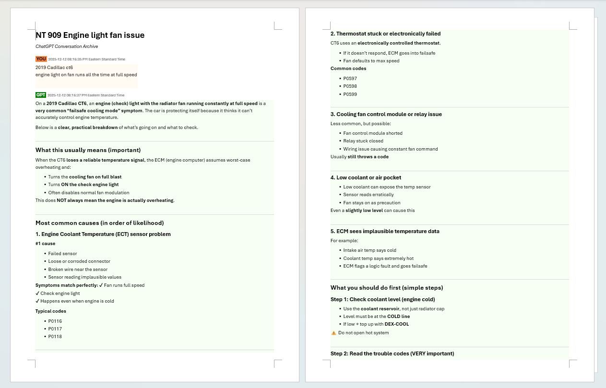
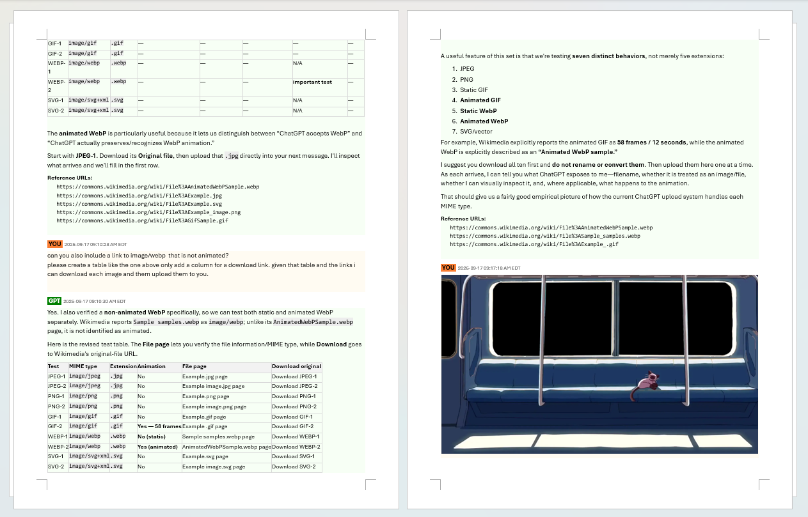
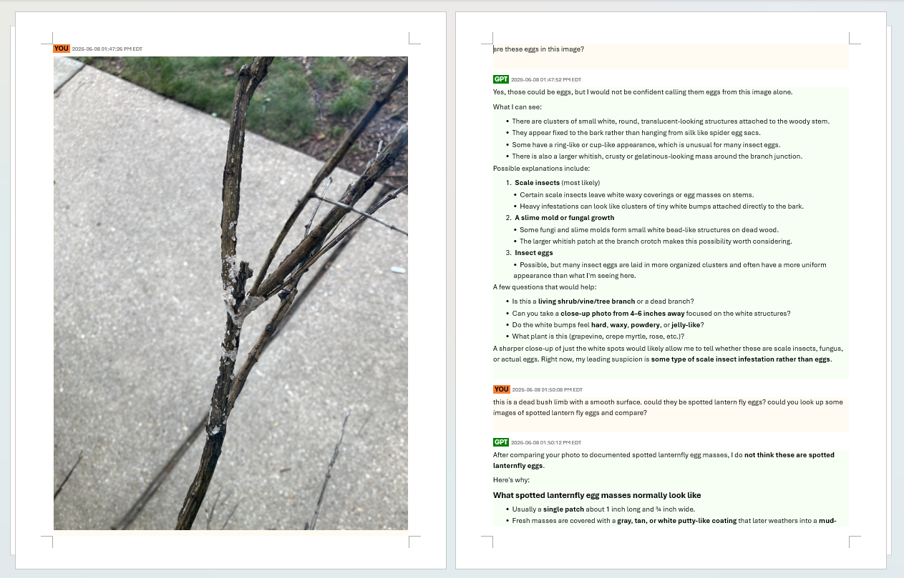

# View Screenshots of Generated DOCX Documents

The following screenshots show examples of ChatGPT conversations preserved as formatted DOCX documents by ChatGPT Conversation Bridge.

Click any screenshot to view the original image at full resolution.

### Screenshot 1 (Conversation Processing)

### Screenshot 2 (Conversation and Inline Wide Image)

### Screenshot 3 (Conversation and Inline Tall Image)

[← Back to Main Information Navigator](../README.md#chatgpt-conversation-bridge)